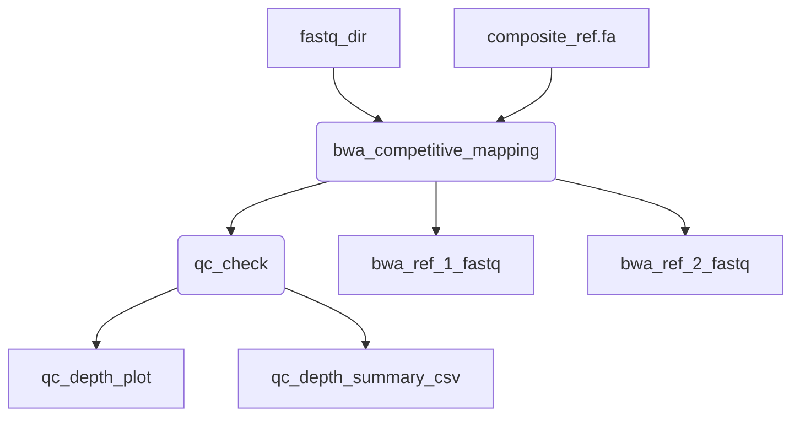
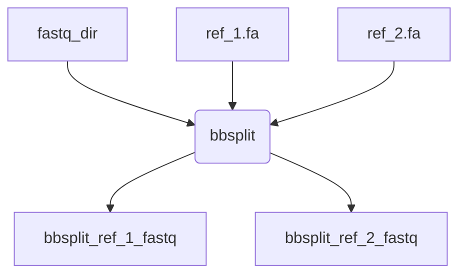

<p align="center">

<p>

# BCCDC-PHL/determinator
A Nextflow pipeline for competitive read splitting using either **BWA-MEM** or **BBSplit**. This tool takes paired-end FASTQ files and separates reads into reference-specific FASTQs based on competitive mapping to two references. 

This pipeline is based on the [readMapping](
https://github.com/jts/ncov2019-artic-nf/blob/6ecf07bef462bfb896ae91629c49116761c03175/modules/illumina.nf#L79-L104)  process in the ARTIC network's Illumina Freebayes consensus generation workflow (originally written by Jared Simpson (@jts))


# Quick Start


## BWA-MEM
Run with **BWA-MEM competitive mapping** (default):  

```bash
nextflow run BCCDC-PHL/determinator \
  --fastq_input /path/to/fastq_dir
  --composite_ref path/to/composite_ref.fa \
  --ref_1_ID <ref 1 accession> \
  --ref_2_ID <ref 2 accession> \
  -profile <conda/apptainer> \
  --cache path/to/cache/dir

```





### Parameters

| Option                           | Default  | Description                                                                                                         |
|:---------------------------------|---------:|--------------------------------------------------------------------------------------------------------------------:|
| `ref_1_ID`                        | `NO_FILE`     | name for reference 1 in output file naming    (used with --bwa)                                                                     |
| `ref_2_ID`                  | `NO_FILE`     | name for reference 2 in output file     (used with --bwa)                                         |
| `composite_ref`            | `NO_FILE`   | path to bwa indexed composite reference (1 and 2)  (for use with bwa competitive mapping process only)                                                                   |
| `fastq_input`               | `NO_FILE`   | path to directory of fastqs to competitively map and split reads that map to reference 1 and 2  into separate fastqs                                                                 |
| `samplesheet_input`                    | `NO_FILE`     | samplesheet containing ID,R1,R2 with sample name and paths to fastq reads      |
| `bwa`                    |  `true`   | default read splitting method using bwa and samtools                                          |
| `min_mapq`                    |  `10`   | Don't output reads with a mapQ score below this value.                                          |
| `bwa_T`                    |  `30`   | Don’t output alignment with score lower than INT. This option only affects output.  30 is the default value given by bwa.                              |


### `--composite_ref` initial set up

Prior to running determinator for the first time, you will need to generate an index for your composite reference.

To do this, you must concatenate your two references (ref_1 and ref_2) and then index with bwa.

```
cat ref_1.fasta ref_2.fasta > composite_ref_1_ref_2.fasta
bwa index composite_ref_1_ref_2.fasta
```

You will pass the indexed composite reference ***composite_ref_1_ref_2.fasta*** to the `--composite_ref` parameter but you must also ensure the 5 files created by bwa index are present in the same directory (*.bwt|*.pac|*.ann|*.amb|*.sa) . These files will automatically be parsed as input by the pipeline to ensure apptainer compatibility.


## Alternative splitting method with `--bbsplit`

Note: This process uses bbsplit instead of BWA-MEM

```
nextflow run BCCDC-PHL/determinator \
  --bbsplit \
  --ref_1 path/to/ref_1.fa \
  --ref_2 path/to/ref_2.fa \
  --ref_1_ID <ref 1 accession> \
  --ref_2_ID <ref 2 accession> \
  --fastq_input /path/to/fastq_dir \
  -profile <conda/apptainer> \
  --cache path/to/cache/dir

```

At this time, both the path to the reference and the reference ID is required with bbsplit. 




## Parameters

| Option                           | Default  | Description                                                                                                         |
|:---------------------------------|---------:|--------------------------------------------------------------------------------------------------------------------:|
| `ref_1`       | `NO_FILE`    | path to reference 1  (used with --bbsplit)                                                       |
| `ref_2`          | `NO_FILE`      | path to reference 2  (used with --bbsplit)                                                      |                                                        |
| `ref_1_ID`                        | `NO_FILE`     | name for reference 1 in output file                                                                    |
| `ref_2_ID`                  | `NO_FILE`     | name for reference 2 in output file                
| `fastq_input`               | `NO_FILE`   | path to directory of fastqs to competitively map and split reads that map to reference 1 and 2 into separate fastqs                                                                  |
| `samplesheet_input`                    | `NO_FILE`     | samplesheet containing ID,R1,R2 with sample name and paths to fastq reads      |                                    |
| `bbsplit`                    |    `false`  | use bbsplit for read splitting method |
| `bbsplit_ambigious2`                    |    `toss`  | Set behavior only for reads that map ambiguously to multiple different references default=  toss     options:  best   (use the first best site) toss   (consider unmapped) all   (write a copy to the output for each reference to which it maps) split   (write a copy to the AMBIGUOUS_ output for each reference to which it maps) |


## Outputs


### sorted fastq directories


**bwa_ref1_fastq**  

This directory contains fastq files with reads from your original input that map only to ref1 from the composite reference. 

**bwa_ref2_fastq**

This directory contains fastq files with reads from your original input that map only to ref2 from the composite reference. 


NOTE: This will be the default output or when run with `--bwa`. The bbsplit fastq directories will only be output if run with `--bsplit`. The bwa fastq directories will **not** be output when run with `--bbsplit`.


**bbsplit_ref1_fastq**  

This directory contains fastq files with reads from your original input that map only to ref1 using bbsplit

**bbsplit_ref2_fastq**

This directory contains fastq files with reads from your original input that map only to ref2 using bbsplit.


## Additional QC outputs
The following outputs are only available with default **BWA-MEM** method. These outputs are **not** available when using bbsplit.


**qc_plots**

Each sample will contain a QC plot showing the depth of coverage across each reference in the composite reference.


**read_summary**

Each sample will have an individual read summary in this output folder. At the top level of the output directory will be a combined_read_summary.csv with all samples combined.


| sample_id | reference   | read_count | pct_total_reads |
|-----------|-------------|------------|-----------------|
| test      | PP109421.1  | 1274935    | 99.26           |
| test      | OP975389.1  | 9505       | 0.74            |
| test      | other       | 0          | 0.00            |


**depth_summaries**

Each sample will have an individual depth summary in this folder. At the top level of the output directory will be a combined_depth_summary.csv with all samples combined.

| sample_id | reference   | total_positions | covered_positions | percent_covered | average_depth | median_depth |
|-----------|-------------|-----------------|------------------|-----------------|---------------|--------------|
| test     | PP109421.1  | 15225           | 14746            | 96.85           | 10940.73      | 5035.0       |
| test     | OP975389.1  | 15222           | 730              | 4.8             | 16.31         | 0.0          |


# DETERMINATORSV

This pipeline was originally designed for use with RSV. However, this pipeline is **not** pathogen specific. Run BCCDC-PHL/determinator with `--rsv` when working with RSV. This will not change the results but contains a special welcome message from determinatorSV. 


<sub>Hasta la vista RSV ambiguity. DeterminatorSV will be back... with subtypes!</sub>


