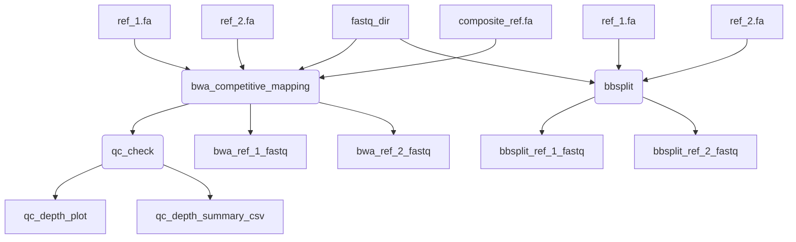

# In development

## Parameters

| Option                           | Default  | Description                                                                                                         |
|:---------------------------------|---------:|--------------------------------------------------------------------------------------------------------------------:|
| `ref_1`       | `NO_FILE`    | path to reference 1                                                         |
| `ref_2`          | `NO_FILE`      | path to reference 2                                                       |
| `ref_1_name`                        | `NO_FILE`     | rame for reference 1 in output file naming                                                                        |
| `ref_2_name`                  | `NO_FILE`     | name for reference 2 in output file                                             |
| `composite_ref`            | `NO_FILE`   | path to bwa indexed composite reference (1 and 2) - for use with bwa_competitive_mapping process only                                                                   |
| `fastq_input`               | `NO_FILE`   | path to directory of fastqs to competitively map and split into reads that map to reference 1 and 2                                                                   |
| `samplesheet_input`                    | `NO_FILE`     | samplesheet containing ID,R1,R2 with sample name and paths to fastq reads      |
| `bwa`                    |  `true`   | default read splitting method using bwa and samtools                                          |
| `bbsplit`                    |    `false`  | use bbsplit for read splitting method |
| `bbsplit_ambigious2`                    |    `toss`  | Set behavior only for reads that map ambiguously to multiple different references default=  toss     options:  best   (use the first best site) toss   (consider unmapped) all   (write a copy to the output for each reference to which it maps) split   (write a copy to the AMBIGUOUS_ output for each reference to which it maps) |
