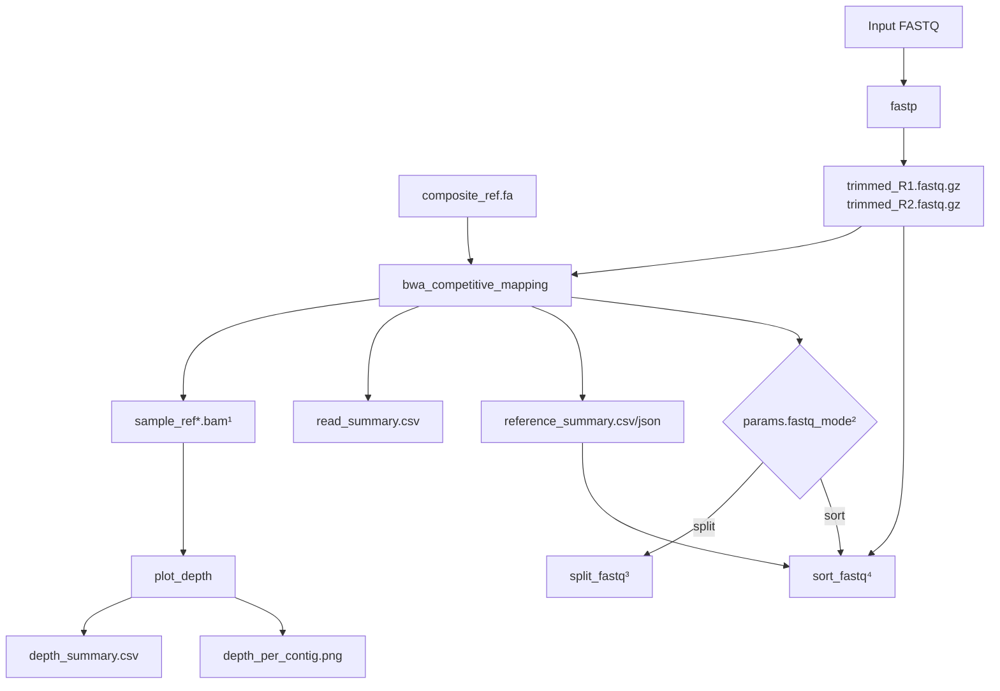
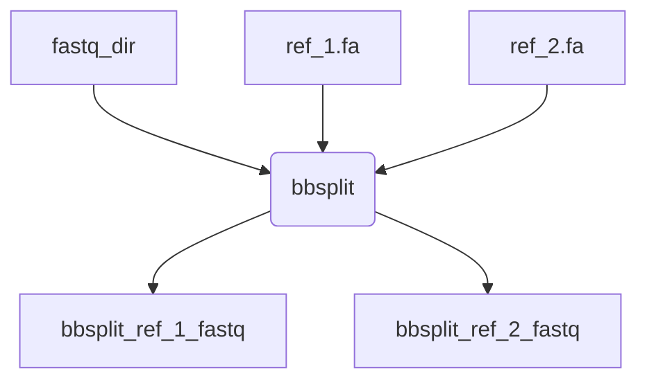
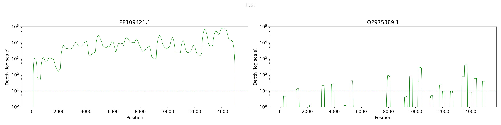

<p align="center">

<p>

# BCCDC-PHL/determinator
A Nextflow pipeline for determining the best matching reference using either **BWA-MEM** or **BBSplit**. This tool takes paired-end FASTQ files and, based on user input, ***sorts*** full FASTQs **or** ***splits*** reads into reference-specific FASTQs based on competitive mapping to multiple references. 

This pipeline is based on the [readMapping](
https://github.com/jts/ncov2019-artic-nf/blob/6ecf07bef462bfb896ae91629c49116761c03175/modules/illumina.nf#L79-L104)  process in the ARTIC network's Illumina Freebayes consensus generation workflow (originally written by Jared Simpson (@jts))


# Quick Start


## BWA-MEM
Run with **BWA-MEM competitive mapping** (default):  

```bash
nextflow run BCCDC-PHL/determinator \
  --fastq_input /path/to/fastq_dir
  --composite_ref path/to/composite_ref.fa \
  --index \
  --fastq_mode <sort/split>
  -profile <conda/apptainer> \
  --cache path/to/cache/dir

```




**Legend**

**¹ `sample_ref*.bam`**  
BAMs generated per each reference in `composite_ref.fa`


**² `params.fastq_mode`**

User controlled `--fastq_mode`:
- `split` → Splits aligned BAMs into per-reference FASTQ directories using samtools fastq.
- `sort` → Sorts fastp trimmed input FASTQs into folders based on top reference assignment from reference_summary.json.ories


**³ split_fastq**  
Directory structure:
```
split_fastq/
├── bwa_fastq_ref1/
│   ├── sample_ref1_R1.fastq.gz
│   └── sample_ref1_R2.fastq.gz
└── bwa_fastq_ref2/

```

**⁴ sort_fastq**

Directory structure:

```
sorted_fastq/
├── ref1/
│   ├── sample_trimmed_R1.fastq.gz
│   └── sample_trimmed_R2.fastq.gz
└── ref2/

```

### Parameters


| Option              | Default    | Description |
|:-------------------|-----------:|------------|
| `composite_ref`     | `NO_FILE`  | Path to your composite reference (a multi fasta of your references) for use with BWA competitive mapping workflow only. Any number of references can be used but it is recommended to perform your own validation of the appropriate number for your application. |
| `index`             | `false`    | Index `composite_ref` input. Add `--index` to run `bwa index` on the composite reference. Index files will be written to the output directory under `indexed_composite_reference`. Once these files are created, you can run determinator without the `index` parameter to save resources. **Note:** BWA index files must be present in the directory of your composite reference to run determinator without the `index` parameter.|
| `fastq_input`       | `NO_FILE`  | Path to a directory of FASTQ files to split or sort into reference-specific FASTQs. |
| `samplesheet_input` | `NO_FILE`  | Samplesheet containing `ID,R1,R2` columns with sample names and FASTQ file paths. |
| `fastq_mode`     | `sort`  | Options: `sort` and `split`. The `sort` fastq mode will sort your fastq files into directories based on the best matching reference in your composite reference. In this mode, all reads are retained. The `split` mode will split the reads from your input fastq into separate fastqs containing only the reads that map best to each reference in your composite reference. `split` mode is designed for handling suspected mixtures. Therefore, for each input fastq, determinator outputs a separate fastq file for each reference in your composite reference. If no reads map to a reference, the output fastq for that reference will be empty.|
| `bwa`               | `true`     | Enable BWA + SAMtools-based read splitting method (default workflow). |
| `min_mapq`          | `10`       | Minimum mapping quality threshold. Reads with MAPQ below this value will not be output. |
| `bwa_T`             | `30`       | Minimum alignment score threshold for output. This affects reporting only; default follows BWA default behavior. |


### `--composite_ref` initial set up

Prior to running determinator for the first time, you will need to generate your composite reference.

To do this, you must concatenate your references: 

```
cat ref_1.fasta ref_2.fasta > composite_ref_1_ref_2.fasta
```

You will pass the indexed composite reference ***composite_ref_1_ref_2.fasta*** to the `--composite_ref` parameter. If you have not indexed the composite reference, use the `--index` parameter. The bwa index files will be available in the output directory under "indexed_composite_reference"   If you want to save resources for subsequent pipeline runs, you can pass only the `--composite_ref` but you must also ensure the 5 files created by bwa index are present in the same directory (*.bwt|*.pac|*.ann|*.amb|*.sa) . These files will automatically be parsed as input by the pipeline to ensure apptainer compatibility.


## Alternative splitting method with `--bbsplit`

Note: This process uses bbsplit instead of BWA-MEM

```
nextflow run BCCDC-PHL/determinator \
  --bbsplit \
  --ref_1 path/to/ref_1.fa \
  --ref_2 path/to/ref_2.fa \
  --ref_1_ID <ref 1 accession> \
  --ref_2_ID <ref 2 accession> \
  --fastq_input /path/to/fastq_dir \
  -profile <conda/apptainer> \
  --cache path/to/cache/dir

```

At this time, both the path to the reference and the reference ID is required with bbsplit. 




## Parameters

| Option                           | Default  | Description                                                                                                         |
|:---------------------------------|---------:|--------------------------------------------------------------------------------------------------------------------:|
| `ref_1`       | `NO_FILE`    | path to reference 1  (used with --bbsplit)                                                       |
| `ref_2`          | `NO_FILE`      | path to reference 2  (used with --bbsplit)                                                      |                                                        |
| `ref_1_ID`                        | `NO_FILE`     | name for reference 1 in output file                                                                    |
| `ref_2_ID`                  | `NO_FILE`     | name for reference 2 in output file                
| `fastq_input`               | `NO_FILE`   | path to directory of fastqs to competitively map and split reads that map to reference 1 and 2 into separate fastqs                                                                  |
| `samplesheet_input`                    | `NO_FILE`     | samplesheet containing ID,R1,R2 with sample name and paths to fastq reads      |                                    |
| `bbsplit`                    |    `false`  | use bbsplit for read splitting method |
| `bbsplit_ambigious2`                    |    `toss`  | Set behavior only for reads that map ambiguously to multiple different references default=  toss     options:  best   (use the first best site) toss   (consider unmapped) all   (write a copy to the output for each reference to which it maps) split   (write a copy to the AMBIGUOUS_ output for each reference to which it maps) |


**bbsplit Outputs**


**bbsplit_ref1_fastq**  

This directory contains fastq files with reads from your original input that map only to ref1 using bbsplit

**bbsplit_ref2_fastq**

This directory contains fastq files with reads from your original input that map only to ref2 using bbsplit.


## Additional QC outputs
The following outputs are only available with the default **BWA-MEM** method. These outputs are **not** available when using bbsplit.


**qc_plots**

Each sample will contain a QC plot showing the depth of coverage across each reference in the composite reference.



**read_summary**

Each sample will have an individual read summary in this output folder. At the top level of the output directory will be a combined_read_summary.csv with all samples combined.


| sample_id | reference   | read_count | pct_total_reads |
|-----------|-------------|------------|-----------------|
| test      | PP109421.1  | 1274935    | 99.26           |
| test      | OP975389.1  | 9505       | 0.74            |
| test      | other       | 0          | 0.00            |


**reference_summary**

Each sample produces an individual *_reference_summary.csv and *_reference_summary.json. A combined summary across all samples is also generated as combined_reference_summary.csv.

This output describes competitive mapping results across the top three references.

CSV Format
| sample_id | top_reference | top_fraction | second_reference | second_fraction | top_vs_second_delta | third_reference | third_fraction | status   |
| --------- | ------------- | ------------ | ---------------- | --------------- | ------------------- | --------------- | -------------- | -------- |
| test      | PP109421.1    | 0.9926       | OP975389.1       | 0.0074          | 0.9852              | NA              | 0.0000         | assigned |


JSON Format

The JSON provides a structured representation suitable for downstream parsing:

- ranked reference list with read counts and fractions for each reference in `composite_ref.fa`
- top/second/third best reference assignments
- delta between top two references
- overall sample classification

```
{
  "sample_id": "test",
  "top_reference": {
    "name": "PP109421.1",
    "fraction": 0.9926
  },
  "second_reference": {
    "name": "OP975389.1",
    "fraction": 0.0074
  },
  "third_reference": {
    "name": null,
    "fraction": 0.0
  },
  "top_vs_second_delta": 0.9852,
  "status": "assigned",
  "total_reads": 1284440,
  "references": [
    {
      "name": "PP109421.1",
      "read_count": 1274935,
      "fraction": 0.9926
    },
    {
      "name": "OP975389.1",
      "read_count": 9505,
      "fraction": 0.0074
    }
  ]
}

```

**depth_summaries**

Each sample will have an individual depth summary in this folder. At the top level of the output directory will be a combined_depth_summary.csv with all samples combined.

| sample_id | reference   | total_positions | covered_positions | percent_covered | average_depth | median_depth |
|-----------|-------------|-----------------|------------------|-----------------|---------------|--------------|
| test     | PP109421.1  | 15225           | 14746            | 96.85           | 10940.73      | 5035.0       |
| test     | OP975389.1  | 15222           | 730              | 4.8             | 16.31         | 0.0          |


# DETERMINATORSV

This pipeline was originally designed for use with RSV. However, this pipeline is **not** pathogen specific. Run BCCDC-PHL/determinator with `--rsv` when working with RSV. This will not change the results but contains a special welcome message from determinatorSV. 


<sub>Hasta la vista RSV ambiguity. DeterminatorSV will be back... with subtypes!</sub>


You can also try `--measles` and `--sarsCoV2` when working with measles and SARS-CoV-2.


